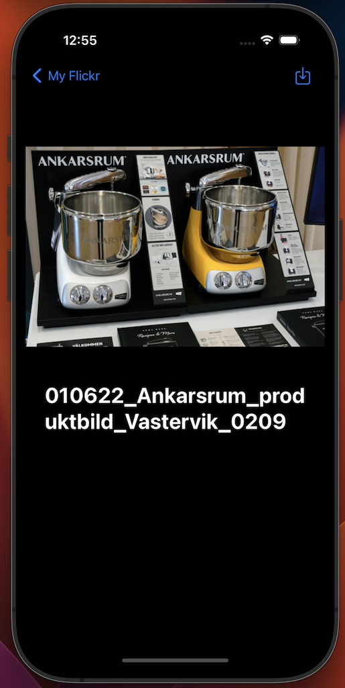
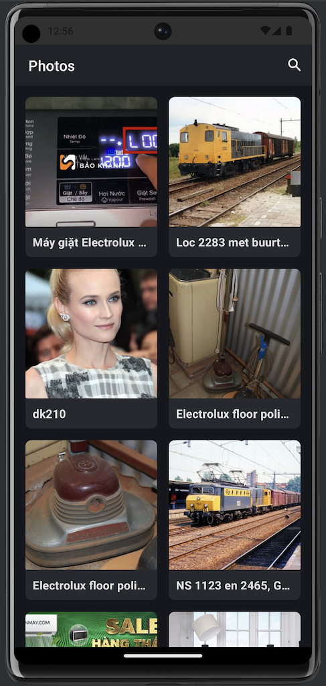
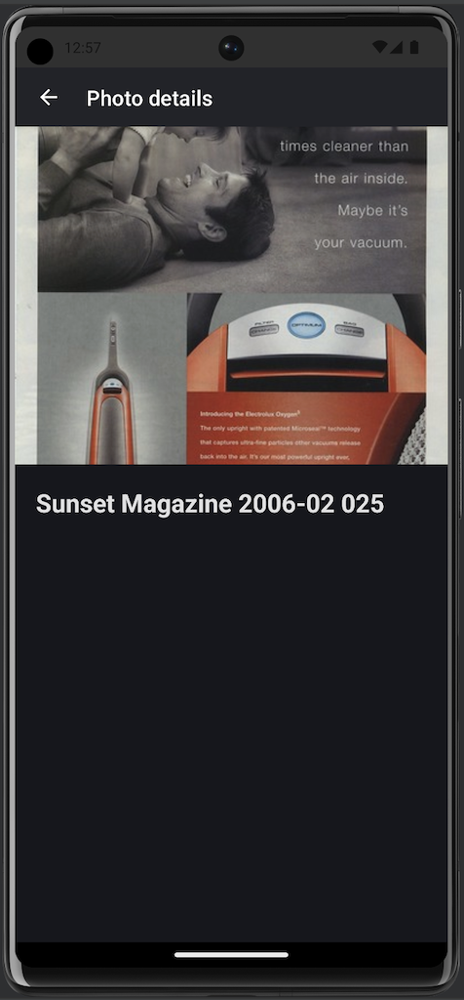

# MyFlickr
Kotlin Multiplatform Flickr Photo App

# Screenshots

- iOS

- Android

# Design Pattern
MVVM/Clean Architecture

# Framework Used
- Kotlin Multiplatform Mobile
- Ktor API
- Koin Dependency Injection
- AndroidX
- SwiftUI
- Jetpack Compose
- Kotlin Coroutines
- KMM module for handling business logic
- assertk
- Unit Tests Implementation

# Installation
Clone this repository and import into Android Studio

git clone git@github.com:adi3246/MyFlickr.git

# License
Copyright 2023 The Android Open Source Project, Inc.

Licensed to the Apache Software Foundation (ASF) under one or more contributor license agreements. See the NOTICE file distributed with this work for additional information regarding copyright ownership. The ASF licenses this file to you under the Apache License, Version 2.0 (the "License"); you may not use this file except in compliance with the License. You may obtain a copy of the License at

http://www.apache.org/licenses/LICENSE-2.0

Unless required by applicable law or agreed to in writing, software distributed under the License is distributed on an "AS IS" BASIS, WITHOUT WARRANTIES OR CONDITIONS OF ANY KIND, either express or implied. See the License for the specific language governing permissions and limitations under the License.

